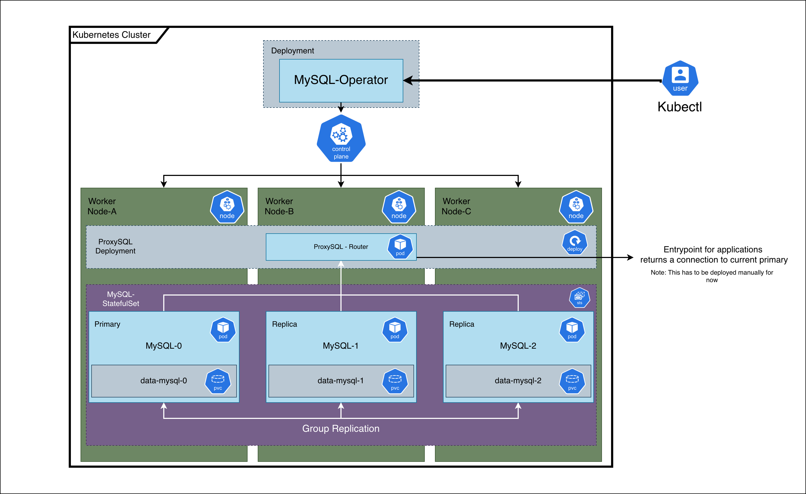

# YAMO (Yet-Another-YAMO)

## Introduction

YAMO is a kubernetes operator with the goal to create and manage a MySQL cluster within Kubernetes. This operator will set up a StatefulSet consisting of 3 database nodes which will be group replicated using MySQL Group Replication to achieve High Availability (HA). 
To highlight what will be created after a Custom Resource(CR) gets applied the following overview can be used:

The operator will setup a 3 node MySQL cluster. This cluster will be set up automatically and configure itself with a `my.cnf` which is present within the operator. If you'd like to see what options get applied view [config_map.go](/internal/controller/k8s/configmap/config_map.go). This file contains the key-value pairs for building the configuration. If you want to override or add additional options its possible to do so via the Custom Resource using the option `mysqlConf` under `spec`. 

To see an example of this visit the custom resource under [samples](/config/samples/database_v1alpha1_mysql.yaml).

## Prerequisites
Before installing this project on a new Kubernetes cluster make sure [cert-manager](https://cert-manager.io/docs/installation/) is present on the cluster.
(Optional): Have [ProxySQL](https://proxysql.com/) ready in a deployment. For now this has to be [setup manually](https://proxysql.com/documentation/proxysql-configuration/). 

## Installation
Please Visit [Installation](https://github.com/elninotech/yet-another-YAMO/wiki/Installation) to find the instructions how to deploy the operator.

## Operator SDK
This project uses [Operator SDK](https://sdk.operatorframework.io/) for its scaffolding and API generation. The operator runs as a controller in Kubernetes. To edit its behavior edit the file under [mysql_controller.go](/internal/controller/mysql_controller.go). This contains the main logic of the operator. 

To manage fields of the Custom Resource (CR) and Custom Resource Definition(CR) the file [mysql_types.go](/api/v1alpha1/mysql_types.go) This file contains the YAMO API.
Make sure to run the `make` command from the makefile to update the relevant YAML files across the project.

## Future Todos
- Integrate ProxySQL Rollout into cluster
- Implement Backup & Restore
- Implement User & Database creation
